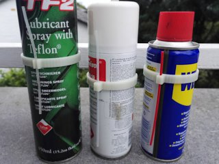
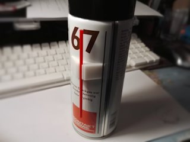

# Yet Another Spray Can Straw Holder
*Customizable holder for spray can straws (formerly thing:1707976)*

### License
[Creative Commons - Attribution](https://creativecommons.org/licenses/by/4.0/)

### Gallery

[🔎](images/YASCSH1.jpg) [🔎](images/YASCSH2.jpg)

## Description and Instructions

Here's yet another straightforward holder to attach spray can straws to the can when unused. This is a customizable model. If none of the example STL files are suitable for your particular can, open the `.scad` file in [OpenSCAD](https://www.openscad.org/) and **[use the OpenSCAD Customizer](https://www.dr-lex.be/3d-printing/customizer.html)** to create a model with your own desired specifications.

The customizer offers the choice between 2 different designs:
* The ‘clamp’ design, as shown in the first photo. The leftmost one is the final iteration (the other ones were experiments), which allows to easily insert and remove the straw without having to slide it all the way through.
* The ‘taped’ design, as shown in the second photo, which is to be attached to the can using tape or glue. This is usually the better option for larger cans.

Three ready-to-print models are included in the examples folder: one ‘clamp’ for spray cans with a diameter of about 52.8mm (typically 200ml), one ‘clamp’ for 57mm cans, and one ‘taped’ for a large 400ml 66mm air duster can from Kontakt Chemie (#67). For each, there is a regular version and a ‘tight’ version. Which one will work best, depends on your printer and settings.

There are two strategies to make your own model that offers a perfect fit for the straw:
1. **Trial-and-error:** just generate several models in Customizer, with straw diameters starting at the exact diameter, and then going up in increments of 0.1 mm. You can reduce the height and opening angle of these models to save on material and printing time. Then print your final model with the diameter that fits best.
2. **The adhesive tape method:** knowing that typical ‘scotch’ tape is about 0.05 mm thick (verify this for your particular tape if you can), you can generate and print one holder with a straw diameter that is slightly too large. For instance, take 2.5 mm if the actual straw is 2.0 mm. Then insert pieces of tape in between the straw and the clamp until you get a nice fit. Knowing the total thickness of all the material you added, you can now generate and print a new model that is likely to be perfect when printed with the same settings as the previous one.\
   If for instance you get a good grip with 5 layers of tape, reduce the straw diameter in customizer by 5 × 0.05 = 0.25 mm. In this particular instance we started from 2.5 mm, so the final model should be created with a straw diameter of 2.25 mm.

### Using

To keep the ring of the ‘clamp’ model from sliding, apply small patches of double-sided adhesive tape on the inside, or some rubbery compound like silicone kit.

For the ‘taped’ model, it is best to use two pieces of tape to leave the gap in the front open. Of course you can also just use one long strip of tape and insert the straw from the top or bottom.

### Print settings I typically use

I print these at 0.2 mm layers, with 100% infill (clamp model) or 0% infill (taped model).

For the ‘clamp’ model, PLA is recommended as it is usually stiffer than ABS or PETG, and may offer a tighter grip around the can. Keep in mind though that my experience tells me that PLA tends to ‘creep’ over time when subjected to a constant force, therefore you may not want to rely too much on clamping force in the first place.

For the ‘taped’ model, any material should be OK, but the more flexible, the less important it will be to get the tolerances exactly right.

## Updates

### 2019/12/13: v2
Made OpenSCAD model to enable customizer, now you can make straw holders for any size of can and straw.

### 2019/12/28: v3
Added ‘taped’ model option to customizer. This produces a smaller holder that needs to be taped to the can, and is more practical for larger cans.

## Tags
`holder`, `spray`, `spray_can`, `straw`, `customizable`, `customizer`, `openscad`
